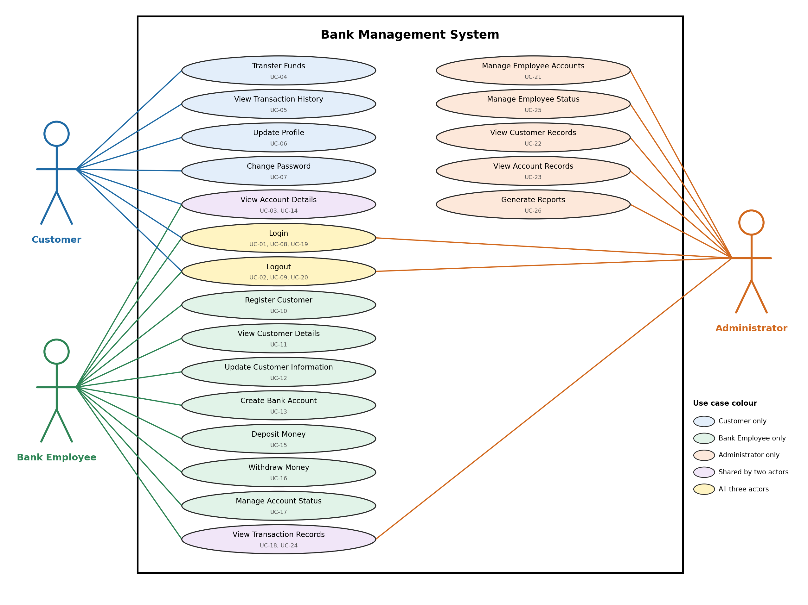

# Software Requirements Specification

## Bank Management System

| Item | Details |
|---|---|
| Document | Software Requirements Specification (SRS) |
| Project | Bank Management System (academic prototype) |
| Phase | Phase 1: Requirements and Analysis |
| Version | 1.0 |
| Date | 29 September 2026 |
| Standard followed | IEEE Std 830-1998 structure, aligned with ISO/IEC/IEEE 29148:2018 |
| Status | Baseline for design and test planning |

### Revision History

| Version | Date | Description |
|---|---|---|
| 0.1 | Phase 1 | Initial problem statement, requirements, use cases, RTM and feasibility study |
| 1.0 | 29 Sep 2026 | Consolidated IEEE-style SRS; vague requirements refined to be measurable; security section added; use case diagram redrawn so Login and Logout are associated with all three actors |

---

## Table of Contents

1. [Introduction](#1-introduction)
2. [Overall Description](#2-overall-description)
3. [Functional Requirements](#3-functional-requirements)
4. [Non-Functional Requirements](#4-non-functional-requirements)
5. [Security](#5-security)
6. [Use Case Model](#6-use-case-model)
7. [Requirement Validation and Traceability](#7-requirement-validation-and-traceability)

---

## 1. Introduction

### 1.1 Purpose

This document specifies the software requirements for the **Bank Management
System (BMS)**. It describes what the system must do (functional requirements),
the quality attributes it must meet (non-functional requirements), and the
security objectives and requirements it must satisfy.

The SRS is intended for:

- **Project team members:** to design, implement and test the system.
- **Course instructors and evaluators:** to assess the completeness and quality
  of the requirements.
- **Testers:** to derive test cases (see [Test Plan](test_plan.md)).
- **Designers:** to derive the architecture and design (see
  [Software Architecture and Design Specification](architecture_design.md)).

### 1.2 Scope

The Bank Management System is a web-based academic prototype that centralizes
customer records, bank accounts and financial transactions for a single bank.
It provides role-based access for three types of users: **Customers**, **Bank
Employees** and **Administrators**.

**In scope:**

- User authentication (login, logout, password change) and role-based access
- Customer registration, viewing and updating
- Bank account creation, unique account numbers and account status management
- Deposit, withdrawal and fund transfer between accounts of the same bank
- Transaction recording and transaction history
- Employee account management by administrators
- Basic administrative reports

**Out of scope** (see [Problem Statement](problem_statement.md#6-out-of-scope)):

- Real banking network, UPI, payment gateway or credit card integration
- Loan processing, stock or investment services
- Inter-bank settlement and integration with RBI or other external institutions
- Processing of real customer data (only dummy test data is used)

**Benefits:** fewer manual errors, consistent account balances, complete
transaction records, and controlled access to sensitive banking information.

### 1.3 Definitions, Acronyms and Abbreviations

| Term | Definition |
|---|---|
| BMS | Bank Management System |
| SRS | Software Requirements Specification |
| FR | Functional Requirement |
| NFR | Non-Functional Requirement |
| UC | Use Case |
| TC | Test Case |
| RTM | Requirement Traceability Matrix |
| SO | Security Objective |
| RBAC | Role-Based Access Control: access is granted according to the user's role |
| API | Application Programming Interface |
| UI | User Interface |
| ACID | Atomicity, Consistency, Isolation, Durability: properties of a database transaction |
| Customer | A bank account holder who uses the system to view accounts and transfer funds |
| Bank Employee | Authorized bank staff who manage customers, accounts, deposits and withdrawals |
| Administrator | A user who manages employee accounts, views records and generates reports |
| Active account | A bank account on which financial transactions are allowed |
| Inactive account | A deactivated bank account; financial transactions are not allowed until it is activated again |
| Frozen account | A temporarily blocked bank account; financial transactions are not allowed until it is unfrozen |
| Financial transaction | A deposit, withdrawal or fund transfer |
| Transaction record | The stored record of a completed financial transaction |
| Password hash | The output of a one-way password-hashing function; the original password cannot be recovered from it |
| Salt | A random value combined with a password before hashing, so identical passwords produce different hashes |
| Session | The authenticated state of a logged-in user, created at login and invalidated at logout |
| Navigation action | One click on a menu item, link or button that opens another page or screen (typing data is not counted) |
| Normal prototype usage | The load conditions defined in assumption A-02 (Section 2.6) |

### 1.4 References

1. IEEE Std 830-1998, *IEEE Recommended Practice for Software Requirements
   Specifications*.
2. ISO/IEC/IEEE 29148:2018, *Systems and software engineering — Life cycle
   processes — Requirements engineering*.
3. Project documents in this repository:
   - [Problem Statement](problem_statement.md)
   - [Feasibility Study](feasibility_study.md)
   - [Requirements List](requirements.md)
   - [Actors and Use Cases](actors_usecases.md)
   - [Use Case Diagram](use_case_diagram.png)
   - [Requirement Traceability Matrix](rtm.md)
   - [Test Plan](test_plan.md)
   - [Software Architecture and Design Specification](architecture_design.md)

### 1.5 Document Overview

- **Section 2** describes the product as a whole: its context, main functions,
  users, environment, constraints and assumptions.
- **Section 3** lists the functional requirements FR-01 to FR-25 with acceptance
  criteria.
- **Section 4** lists the non-functional requirements NFR-01 to NFR-18 with
  acceptance criteria.
- **Section 5** defines the security objectives and security requirements.
- **Section 6** summarizes the use case model (actors, use cases, diagram).
- **Section 7** explains how requirements are validated and traced to use
  cases, design components and test cases.

---

## 2. Overall Description

### 2.1 Product Perspective

The BMS is a new, self-contained system. It replaces manual or disconnected
record keeping (see [Problem Statement](problem_statement.md#3-existing-problems))
with one centralized application and database. It does not connect to any
external banking system.

The system is planned as a three-tier web application:

```text
Web browser (Customer / Bank Employee / Administrator)
        │
        ▼
Presentation Layer   – web user interface (HTML, CSS, JavaScript)
        │
        ▼
Business Logic Layer – authentication, customer, account, transaction,
                       employee administration and reporting services
        │
        ▼
Data Layer           – relational database (MySQL or equivalent)
```

The detailed architecture is described in the
[Software Architecture and Design Specification](architecture_design.md).

### 2.2 Product Functions

| Function Area | Summary | Requirements |
|---|---|---|
| Authentication | Login, logout and role-based access for all users | FR-01 – FR-03 |
| Customer Management | Register, view and update customer information | FR-04 – FR-06 |
| Account Management | Create accounts, generate unique account numbers, view accounts, manage account status | FR-07 – FR-11 |
| Deposit and Withdrawal | Deposit into and withdraw from active accounts with balance checks | FR-12 – FR-14 |
| Fund Transfer | Transfer money between valid accounts with balance checks | FR-15 – FR-17 |
| Transaction Management | Unique transaction IDs, transaction records and history | FR-18 – FR-21 |
| User Account Management | Password change; employee account management | FR-22 – FR-24 |
| Reports | Basic administrative reports | FR-25 |

### 2.3 User Classes and Characteristics

| User Class | Description | Expected Skill Level | Main Functions |
|---|---|---|---|
| Customer | Holder of one or more bank accounts | Basic web browsing | View accounts and balances, transfer funds, view transaction history, update profile, change password |
| Bank Employee | Branch staff member | Trained in bank procedures and basic computer use | Register customers, create accounts, deposit and withdraw on behalf of customers, manage account status, view transaction records |
| Administrator | System-level manager | Trained in system administration | Manage employee accounts, view customer, account and transaction records, generate reports |

The full list of actors and use cases is in
[Actors and Use Cases](actors_usecases.md).

### 2.4 Operating Environment

| Item | Environment |
|---|---|
| Client | A current desktop web browser (Google Chrome, Mozilla Firefox or Microsoft Edge) |
| Server | A backend application/server layer running on a developer laptop or lab machine (Windows, macOS or Linux) |
| Database | MySQL Community Edition or an equivalent relational database |
| Network | Local machine or local network for development and demonstration |
| Tools | Visual Studio Code, Git and GitHub |

### 2.5 Design and Implementation Constraints

| ID | Constraint |
|---|---|
| C-01 | The frontend shall use HTML, CSS and JavaScript ([Feasibility Study](feasibility_study.md#1-technical-feasibility)). |
| C-02 | Data shall be stored in a relational database (MySQL or equivalent) that supports ACID transactions. |
| C-03 | Only free or open-source tools and libraries shall be used ([Feasibility Study](feasibility_study.md#3-economic-feasibility)). |
| C-04 | Git and GitHub shall be used for version control and collaboration. |
| C-05 | Only dummy or test data shall be stored; no real customer information shall be used ([Feasibility Study](feasibility_study.md#6-legal-and-ethical-feasibility)). |
| C-06 | The system shall not integrate with any external banking network or payment service. |
| C-07 | The project shall be completed within the semester schedule, so scope is limited to the functions in Section 2.2. |
| C-08 | The backend framework and session technology have not yet been selected. Requirements and design in this phase are therefore technology-neutral. |

### 2.6 Assumptions and Dependencies

| ID | Assumption / Dependency |
|---|---|
| A-01 | The system is an academic prototype operated by a single bank with a single currency (INR). All amounts use two decimal places. |
| A-02 | "Normal prototype usage" means the system runs in the local test environment with **up to 10 concurrent users**, and the database holds up to **1,000 customers and 10,000 transaction records**. |
| A-03 | Deposits and withdrawals are performed by a Bank Employee on behalf of a customer (UC-15, UC-16). Customers do not deposit or withdraw directly through the system. |
| A-04 | Customers cannot register themselves. A Bank Employee registers the customer (FR-04), and the customer's login credentials are issued at that time. How the initial credentials are delivered to the customer is outside the prototype scope. |
| A-05 | A customer may hold more than one bank account. |
| A-06 | For FR-06, "permitted customer information" that a **Customer** may update is limited to contact details (address, phone number and e-mail). Identity details (such as name and date of birth) may be changed only by a **Bank Employee**. |
| A-07 | At least one Administrator account is created during system setup. There is no use case for creating Administrators through the application. |
| A-08 | FR-22 (change password) applies to all user roles. The existing use case UC-07 describes it for Customers; Bank Employees and Administrators use the same function. |
| A-09 | A frozen or inactive account can still be viewed (FR-09). Only financial transactions are blocked (FR-11). |
| A-10 | The test environment has a browser, the backend application/server layer and the database installed and seeded with test data before testing begins. |

### 2.7 External Interface Requirements

| Interface | Description |
|---|---|
| User interface | Browser-based pages with a role-specific navigation menu, forms with field-level validation messages, and confirmation screens for financial transactions. |
| Software interface | The backend communicates with the relational database through a data access layer using parameterized queries and database transactions. |
| Communication interface | The browser communicates with the backend over HTTP using request/response messages (planned REST-style API; see [API Design](architecture_design.md#9-api-design)). HTTPS should be used if the prototype is deployed beyond a local machine. |
| Hardware interface | No special hardware is required. |

---

## 3. Functional Requirements

The functional requirements FR-01 to FR-25 are taken from
[requirements.md](requirements.md) without renumbering. Each requirement has an
acceptance criterion so that it can be verified by testing. Priority is **High**
(essential for the prototype) or **Medium** (important, but the core banking
flow works without it).

### 3.1 Authentication

| ID | Requirement | Use Case(s) | Priority | Acceptance Criterion |
|---|---|---|---|---|
| FR-01 | The system shall allow registered users to log in using valid credentials. | UC-01, UC-08, UC-19 | High | A registered active user who enters a correct username and password is logged in and sees the dashboard for their role. Incorrect credentials are rejected with a generic error message. |
| FR-02 | The system shall allow authenticated users to log out securely. | UC-02, UC-09, UC-20 | High | After logout, the session is invalidated. Using the browser Back button or repeating a previous request does not give access to protected pages or operations. |
| FR-03 | The system shall provide different levels of access based on the user's role such as Customer, Bank Employee and Administrator. | All role-specific use cases | High | Each role can open only the functions listed for it in [Actors and Use Cases](actors_usecases.md). Every other function is denied. |

### 3.2 Customer Management

| ID | Requirement | Use Case(s) | Priority | Acceptance Criterion |
|---|---|---|---|---|
| FR-04 | The system shall allow authorized bank employees to register a new customer. | UC-10 | High | A Bank Employee who submits all mandatory customer details creates a new customer record with a unique customer ID. |
| FR-05 | The system shall allow authorized users to view customer details. | UC-11, UC-22 | High | A Bank Employee or Administrator who searches by customer ID or name sees the correct customer details. |
| FR-06 | The system shall allow customers or authorized employees to update permitted customer information. | UC-06, UC-12 | Medium | A Customer can update only their own contact details (A-06). A Bank Employee can update any customer detail except the customer ID. The updated values are stored and displayed. |

### 3.3 Account Management

| ID | Requirement | Use Case(s) | Priority | Acceptance Criterion |
|---|---|---|---|---|
| FR-07 | The system shall allow authorized bank employees to create a bank account for a registered customer. | UC-13 | High | A Bank Employee can create an account only for an existing customer. The new account starts in **Active** status with a zero or specified opening balance. |
| FR-08 | The system shall generate a unique account number for every bank account. | UC-13 | High | No two accounts, including inactive ones, ever share an account number. |
| FR-09 | The system shall allow customers to view their account details and current balance. | UC-03, UC-14, UC-23 | High | A Customer sees the account number, type, status and current balance of their own accounts only. The balance shown equals the stored balance. |
| FR-10 | The system shall allow authorized employees to activate, deactivate, freeze or unfreeze a bank account. | UC-17 | High | A Bank Employee can change an account's status between **Active**, **Inactive** and **Frozen**. The new status takes effect immediately. |
| FR-11 | The system shall prevent financial transactions on frozen or inactive accounts. | UC-04, UC-15, UC-16, UC-17 | High | Any deposit, withdrawal or transfer involving a frozen or inactive account (as sender or receiver) is rejected. No balance changes and no transaction record is created. |

### 3.4 Deposit and Withdrawal

| ID | Requirement | Use Case(s) | Priority | Acceptance Criterion |
|---|---|---|---|---|
| FR-12 | The system shall allow money to be deposited into an active bank account. | UC-15 | High | A deposit of a valid positive amount increases the account balance by exactly that amount. |
| FR-13 | The system shall allow money to be withdrawn from an active bank account. | UC-16 | High | A withdrawal of a valid positive amount not greater than the balance decreases the balance by exactly that amount. |
| FR-14 | The system shall reject a withdrawal if the account does not contain sufficient balance. | UC-16 | High | A withdrawal greater than the current balance is rejected with an "insufficient balance" message, and the balance is unchanged. |

### 3.5 Fund Transfer

| ID | Requirement | Use Case(s) | Priority | Acceptance Criterion |
|---|---|---|---|---|
| FR-15 | The system shall allow customers to transfer money from their account to another valid bank account. | UC-04 | High | A Customer can transfer a valid positive amount from one of their own active accounts to a different existing active account. |
| FR-16 | The system shall verify that sufficient balance is available before processing a fund transfer. | UC-04 | High | A transfer greater than the sender's current balance is rejected, and neither balance changes. |
| FR-17 | The system shall update both the sender's and receiver's account balances after a successful transfer. | UC-04 | High | After a successful transfer of amount X, the sender balance decreases by X and the receiver balance increases by X. |

### 3.6 Transaction Management

| ID | Requirement | Use Case(s) | Priority | Acceptance Criterion |
|---|---|---|---|---|
| FR-18 | The system shall generate a unique transaction ID for every successful financial transaction. | UC-04, UC-15, UC-16 | High | Every completed deposit, withdrawal and transfer has a transaction ID that is different from all other transaction IDs. |
| FR-19 | The system shall record details of every completed deposit, withdrawal and fund transfer. | UC-04, UC-15, UC-16 | High | Each completed financial transaction has a stored record with transaction ID, type, amount, account number(s), date and time. |
| FR-20 | The system shall allow customers to view their transaction history. | UC-05 | High | A Customer sees the transactions of their own accounts only, newest first. |
| FR-21 | The system shall allow authorized bank employees and administrators to view transaction records. | UC-18, UC-24 | Medium | A Bank Employee or Administrator can view transaction records filtered by account number and date range. |

### 3.7 User Account Management

| ID | Requirement | Use Case(s) | Priority | Acceptance Criterion |
|---|---|---|---|---|
| FR-22 | The system shall allow users to change their password. | UC-07 (see A-08) | Medium | After a user changes their password (the current password must be entered first), the new password works for login and the old password is rejected. |
| FR-23 | The system shall allow administrators to create and manage employee accounts. | UC-21 | High | An Administrator can create an employee account and update its details. The new employee can log in with the Bank Employee role. |
| FR-24 | The system shall allow administrators to deactivate employee accounts. | UC-25 | Medium | After an Administrator deactivates an employee account, that employee can no longer log in. The employee's existing session is no longer accepted for protected operations. |

### 3.8 Reports

| ID | Requirement | Use Case(s) | Priority | Acceptance Criterion |
|---|---|---|---|---|
| FR-25 | The system shall allow administrators to view basic reports related to customers, accounts and transactions. | UC-26 | Medium | For a selected date range, the report shows at least: the total number of customers, the number of accounts in each status, and the number and total value of deposits, withdrawals and transfers. The figures match the stored data. |

---

## 4. Non-Functional Requirements

The non-functional requirements NFR-01 to NFR-18 are taken from
[requirements.md](requirements.md) without renumbering. Requirements marked
**(refined)** have been reworded in this version so that they are measurable and
testable. Their original intention has not changed, and the same wording is used
in [requirements.md](requirements.md).

### 4.1 Security

| ID | Requirement | Acceptance Criterion |
|---|---|---|
| NFR-01 **(refined)** | User passwords shall not be stored in plain text. They shall be stored only as salted one-way hashes produced by a password-hashing algorithm, and shall never be written to logs or returned in any response. | Inspecting the user table shows only hash values, and two users with the same password have different hash values. No password appears in application logs or responses. |
| NFR-02 | The system shall restrict access to features based on the authenticated user's role. | Every function is available only to the roles listed in [Actors and Use Cases](actors_usecases.md). Other roles receive an "unauthorized operation" error. |
| NFR-03 | The system shall prevent unauthorized users from accessing customer, account and transaction information. | A Customer cannot view another customer's data by changing an ID in a URL or request. Unauthenticated requests for such data are rejected. |
| NFR-04 **(refined)** | The system shall validate user input before processing banking operations. It shall check required fields, data type, format, length and permitted range (for example, amounts must be greater than zero with at most two decimal places), and shall reject invalid input without modifying stored data. | Submitting empty, wrongly formatted, too long, negative or zero values is rejected with a field-level error, and no data changes. |
| NFR-05 **(refined)** | Sensitive banking operations shall only be performed after successful authentication. Requests to protected operations without a valid authenticated session shall be rejected. | Calling any protected operation without logging in, or after logout, is rejected with an "authentication required" error. |

### 4.2 Performance

| ID | Requirement | Acceptance Criterion |
|---|---|---|
| NFR-06 **(refined)** | Normal system operations such as login, balance enquiry and viewing transaction history shall respond within 3 seconds for at least 95% of requests under normal prototype usage (up to 10 concurrent users in the local test environment; SRS assumption A-02). | In 20 timed repetitions of each operation, at most 1 takes longer than 3 seconds. |
| NFR-07 **(refined)** | Financial transactions shall be processed within 5 seconds for at least 95% of requests under normal prototype usage (up to 10 concurrent users in the local test environment; SRS assumption A-02). | In 20 timed deposits, withdrawals and transfers, at most 1 takes longer than 5 seconds. |

### 4.3 Reliability

| ID | Requirement | Acceptance Criterion |
|---|---|---|
| NFR-08 | The system shall maintain consistent account balances after every successful financial transaction. | For each account, the stored balance equals the opening balance plus all credits minus all debits in its transaction records. |
| NFR-09 | If a transaction fails before completion, the system shall not leave account balances in a partially updated state. | When a failure is forced in the middle of a transfer, both balances are unchanged and no transaction record exists for it. |
| NFR-10 **(refined)** | The system shall store exactly one transaction record for every completed financial transaction, containing the transaction ID, type, amount, account number(s), date and time. Stored transaction records shall not be editable or deletable through the application. | The number of transaction records equals the number of completed transactions, each record's details match the operation, and no application function can edit or delete a record. |

### 4.4 Usability

| ID | Requirement | Acceptance Criterion |
|---|---|---|
| NFR-11 **(refined)** | After login, the user interface shall display a navigation menu that contains only the operations permitted for the logged-in user's role, and this menu shall be available on every page. | For each role, the menu lists exactly that role's permitted operations and appears on every page after login. |
| NFR-12 **(refined)** | When an operation is rejected, the system shall display a message that states the reason (for example, insufficient balance, frozen account or invalid input field). It shall not display stack traces, database errors or other internal system details. | Each rejected operation in the test cases shows a message that names the reason, and no message contains technical internals. |
| NFR-13 | After login, users shall be able to access permitted core banking operations within at most 3 navigation actions. | From the dashboard, each core operation for the role can be opened in 3 or fewer navigation actions. |

### 4.5 Maintainability

| ID | Requirement | Acceptance Criterion |
|---|---|---|
| NFR-14 **(refined)** | The system shall be divided into separate modules for authentication, customer management, account management, transaction management, employee administration and reporting. A change to one module shall not require changes to the internal code of unrelated modules. | A code review confirms the six modules exist and that modules interact only through their defined interfaces. |
| NFR-15 **(refined)** | Source code shall follow a single naming convention documented by the team, and every business-logic module and public function shall include a comment describing its purpose, inputs and outputs. | A code review finds no naming-convention violations and no undocumented public business-logic functions. |

### 4.6 Data Integrity

| ID | Requirement | Acceptance Criterion |
|---|---|---|
| NFR-16 | Every customer, account and transaction shall have a unique identifier. | The database enforces a primary key or unique constraint on each identifier, and duplicate identifiers cannot be inserted. |
| NFR-17 | Account balances and transaction records shall remain consistent after deposit, withdrawal and fund transfer operations. | After any sequence of operations, balances agree with the transaction records (see NFR-08). |
| NFR-18 | The system shall prevent invalid or incomplete data from being stored in the database. | Attempts to store records with missing mandatory fields or invalid values are rejected by validation and by database constraints. |

---

## 5. Security

The BMS handles sensitive financial and personal information. This section
defines what the system must protect (security objectives) and the specific
requirements that achieve that protection (security requirements).

### 5.1 Security Objectives

| ID | Objective | Description |
|---|---|---|
| SO-01 | **Confidentiality** | Sensitive customer, account and transaction information must only be accessible to authorized users. A Customer may see only their own data. |
| SO-02 | **Integrity** | Unauthorized modification of customer records, account balances and transaction information must be prevented. Financial operations must never leave data partially updated. |
| SO-03 | **Authentication and Authorization** | Users must be authenticated and only permitted to access functionality allowed by their assigned role. |
| SO-04 | **Accountability** | Every completed financial transaction must be traceable through a unique, unmodifiable transaction record. |

### 5.2 Security Requirements

The following requirements implement the security objectives. NFR-01 to NFR-05
are the primary security requirements. The listed functional and integrity
requirements support them.

| ID | Security Requirement | Rationale | Verified By |
|---|---|---|---|
| NFR-01 | Passwords stored only as salted one-way hashes; never logged or returned. | A database leak must not reveal user passwords. | TC-09 |
| NFR-02 | Access to features is restricted by the authenticated user's role. | Prevents privilege escalation, for example a Customer using employee functions. | TC-03 |
| NFR-03 | Unauthorized users cannot access customer, account or transaction information. | Prevents a user from viewing another person's financial data. | TC-03, TC-16 |
| NFR-04 | All input is validated before processing, and invalid input is rejected without changing data. | Prevents malformed data, negative amounts and injection attacks. | TC-12 |
| NFR-05 | Sensitive operations require a valid authenticated session. | Prevents anonymous or logged-out use of banking functions. | TC-03, TC-13 |
| FR-02 | Logout invalidates the session. | A session must not remain usable after logout. | TC-13 |
| FR-11 | No financial transactions on frozen or inactive accounts. | Allows the bank to block suspicious or closed accounts. | TC-08 |
| FR-24 | Deactivated employees cannot log in. | Removes access for staff who have left. | TC-18 |
| NFR-09 | Failed transactions leave no partial balance updates. | Protects balance integrity. | TC-10 |
| NFR-10 | One unmodifiable record per completed transaction. | Supports auditing and dispute resolution. | TC-05, TC-07 |

### 5.3 Security Objective to Requirement Mapping

| Security Objective | Related Requirement IDs |
|---|---|
| SO-01 Confidentiality | NFR-01, NFR-02, NFR-03, NFR-05, NFR-12, FR-03 |
| SO-02 Integrity | NFR-04, NFR-08, NFR-09, NFR-17, NFR-18, FR-11, FR-16 |
| SO-03 Authentication and Authorization | NFR-01, NFR-02, NFR-05, FR-01, FR-02, FR-03, FR-22, FR-24 |
| SO-04 Accountability | NFR-10, NFR-16, FR-18, FR-19 |

### 5.4 Threats Addressed

| Threat | Example | Countermeasure (Requirement) |
|---|---|---|
| Credential theft from the database | Password table is copied | Salted password hashing (NFR-01) |
| Username discovery | Error message says "user not found" | Generic login error for all login failures (FR-01, NFR-12) |
| Privilege escalation | Customer opens an employee page by typing its URL | Server-side role check on every request (NFR-02) |
| Access to another customer's data | Customer changes the account ID in a request | Ownership check on every account and transaction request (NFR-03) |
| Injection and malformed input | SQL fragments or negative amounts in a form | Input validation and parameterized queries (NFR-04, NFR-18) |
| Use of an old session | Back button or reuse of a request after logout | Session invalidation (FR-02, NFR-05) |
| Partial or inconsistent updates | Failure between debit and credit | Atomic database transactions (NFR-09, NFR-17) |
| Information leakage | Stack trace shown to the user | Safe error messages (NFR-12) |

**Security limitations of the prototype:** multi-factor authentication,
account lockout after repeated failed logins, encryption of data at rest and
formal penetration testing are not required in Phase 1. They are recorded as
possible future enhancements ([Feasibility Study](feasibility_study.md#5-security-feasibility)).

---

## 6. Use Case Model

### 6.1 Use Case Diagram



*Figure 1: UML use case diagram of the Bank Management System.*

Login and Logout (UC-01/UC-02, UC-08/UC-09, UC-19/UC-20) are used by all three
actors, as defined in [Actors and Use Cases](actors_usecases.md#3-use-case-relationships).

### 6.2 Actors

| Actor | Description |
|---|---|
| Customer | Bank account holder who views account information, transfers funds, views transaction history, updates their profile and changes their password. |
| Bank Employee | Authorized staff member who registers customers, creates and manages accounts, performs deposits and withdrawals, and views transaction records. |
| Administrator | Manages employee accounts, views customer, account and transaction records, and generates reports. |

### 6.3 Use Case Summary

| Use Case ID | Use Case | Actor | Related Requirements |
|---|---|---|---|
| UC-01 | Login | Customer | FR-01, FR-03, NFR-05 |
| UC-02 | Logout | Customer | FR-02 |
| UC-03 | View Account Details | Customer | FR-09, NFR-03 |
| UC-04 | Transfer Funds | Customer | FR-11, FR-15, FR-16, FR-17, FR-18, FR-19, NFR-09 |
| UC-05 | View Transaction History | Customer | FR-20, NFR-03 |
| UC-06 | Update Profile | Customer | FR-06 |
| UC-07 | Change Password | Customer | FR-22, NFR-01 |
| UC-08 | Login | Bank Employee | FR-01, FR-03 |
| UC-09 | Logout | Bank Employee | FR-02 |
| UC-10 | Register Customer | Bank Employee | FR-04, NFR-16, NFR-18 |
| UC-11 | View Customer Details | Bank Employee | FR-05 |
| UC-12 | Update Customer Information | Bank Employee | FR-06 |
| UC-13 | Create Bank Account | Bank Employee | FR-07, FR-08 |
| UC-14 | View Account Details | Bank Employee | FR-09 |
| UC-15 | Deposit Money | Bank Employee | FR-11, FR-12, FR-18, FR-19 |
| UC-16 | Withdraw Money | Bank Employee | FR-11, FR-13, FR-14, FR-18, FR-19 |
| UC-17 | Manage Account Status | Bank Employee | FR-10, FR-11 |
| UC-18 | View Transaction Records | Bank Employee | FR-21 |
| UC-19 | Login | Administrator | FR-01, FR-03 |
| UC-20 | Logout | Administrator | FR-02 |
| UC-21 | Manage Employee Accounts | Administrator | FR-23 |
| UC-22 | View Customer Records | Administrator | FR-05 |
| UC-23 | View Account Records | Administrator | FR-09 |
| UC-24 | View Transaction Records | Administrator | FR-21 |
| UC-25 | Manage Employee Status | Administrator | FR-24 |
| UC-26 | Generate Reports | Administrator | FR-25 |

### 6.4 Key Use Case Descriptions

**UC-04 Transfer Funds** (Customer)

| Field | Description |
|---|---|
| Precondition | Customer is logged in and owns at least one active account. |
| Main flow | 1. Customer selects a source account. 2. Customer enters the receiver account number and amount. 3. System validates the input. 4. System checks that both accounts exist and are active. 5. System checks the sender's balance. 6. System debits the sender, credits the receiver and records the transaction in one atomic operation. 7. System shows the transaction ID and new balance. |
| Alternative flows | Invalid input → validation error. Receiver not found → "account not found". Sender or receiver frozen/inactive → "account frozen or inactive". Insufficient balance → "insufficient balance". Processing failure → all changes rolled back and "transaction failed" shown. |
| Postcondition | On success, both balances are updated and one transaction record exists. On failure, no data has changed. |
| Requirements | FR-11, FR-15, FR-16, FR-17, FR-18, FR-19, NFR-04, NFR-07, NFR-09 |
| Design | [Fund transfer sequence diagram](diagrams/fund_transfer_sequence.md) |

**UC-01 / UC-08 / UC-19 Login** (all actors)

| Field | Description |
|---|---|
| Precondition | The user has a registered, active user account. |
| Main flow | 1. User enters username and password. 2. System verifies the password against the stored hash. 3. System identifies the user's role. 4. System creates an authenticated session. 5. System shows the dashboard and menu for that role. |
| Alternative flows | Unknown username, wrong password or deactivated account → the same generic "invalid username or password" message. |
| Postcondition | On success, an authenticated session exists for the user's role. |
| Requirements | FR-01, FR-03, NFR-01, NFR-05, NFR-11 |
| Design | [Login sequence diagram](diagrams/login_sequence.md) |

---

## 7. Requirement Validation and Traceability

### 7.1 Requirement Quality Criteria

Each requirement in this SRS was reviewed against the following criteria:

| Criterion | How it is met |
|---|---|
| Clear and concise | Each requirement states one capability or constraint using "shall". |
| Unambiguous | Vague terms such as "clear navigation", "meaningful" and "normal usage" were replaced with defined terms or measurable conditions (Section 1.3, A-02). |
| Measurable | Performance, usability and reliability requirements have numerical or countable acceptance criteria. |
| Testable | Every FR and NFR has an acceptance criterion, and most are covered by at least one test case in the [Test Plan](test_plan.md). |
| Traceable | Every requirement has a unique ID and is mapped to use cases, design components and test cases in the [RTM](rtm.md). |

### 7.2 Verification Methods

| Method | Used For |
|---|---|
| Test | Functional behavior, security controls and performance (FR-01 – FR-25, NFR-01 – NFR-13, NFR-16 – NFR-18) |
| Inspection | Password storage, database constraints, code structure (NFR-01, NFR-14, NFR-15, NFR-16) |
| Analysis | Balance consistency across transaction records (NFR-08, NFR-17) |
| Demonstration | Navigation and role-specific menus (NFR-11, NFR-13) |

### 7.3 Traceability

Full traceability is kept in the [Requirement Traceability Matrix](rtm.md). It
maps each requirement in this chain:

```text
Requirement (FR/NFR) → Use Case (UC) → Architecture Component → Test Case (TC)
```

Examples:

| Requirement | Use Case | Architecture Component | Test Case |
|---|---|---|---|
| FR-15 Transfer funds | UC-04 | Transaction Service | TC-07 |
| FR-03 / NFR-02 Role-based access | All role-specific UCs | Authentication & Authorization Service | TC-03 |
| NFR-09 No partial updates | UC-04, UC-15, UC-16 | Transaction Service + Data Access Layer + Relational Database | TC-10 |
| NFR-01 Password hashing | UC-01, UC-07 | Authentication & Authorization Service | TC-09 |

### 7.4 Requirement Change Control

Requirement IDs are permanent and are never reused or renumbered. A change to a
requirement is recorded in the revision history of this document, and the
[RTM](rtm.md), [Test Plan](test_plan.md) and
[Software Architecture and Design Specification](architecture_design.md) are
updated in the same change.
