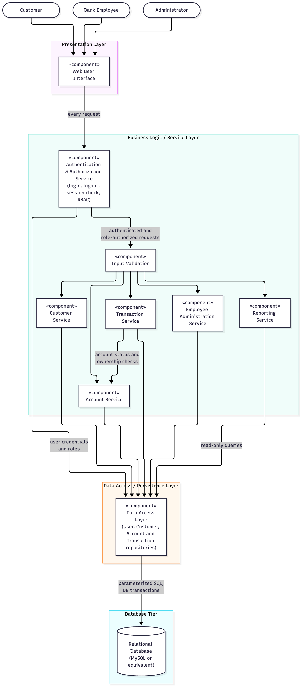
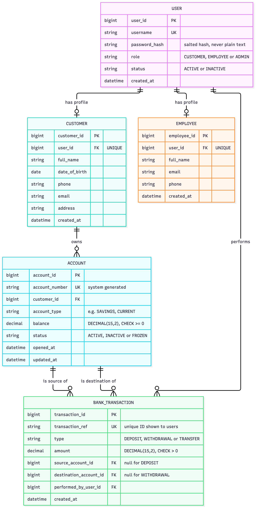
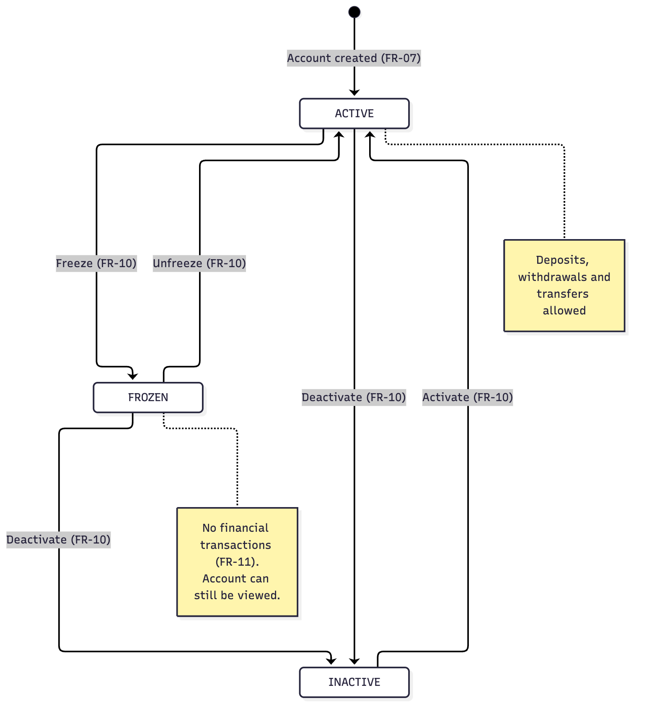
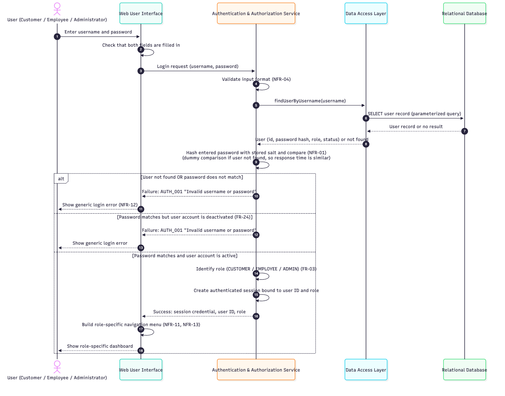
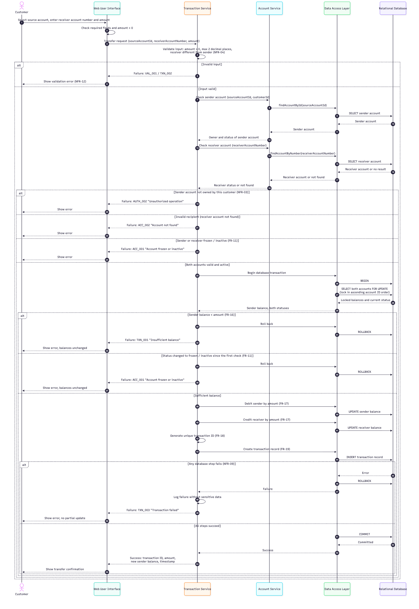

# Software Architecture and Design Specification

## Bank Management System

| Item | Details |
|---|---|
| Document | Software Architecture and Design Specification |
| Project | Bank Management System (academic prototype) |
| Phase | Phase 1: Architecture and Preliminary Design |
| Version | 1.0 |
| Date | 29 September 2026 |
| Standard followed | IEEE Std 1016-2009 (Software Design Descriptions), ISO/IEC/IEEE 42010 concepts |
| Related documents | [SRS](SRS.md), [Test Plan](test_plan.md), [RTM](rtm.md) |

> **Status of this design:** The system has not been implemented yet. All
> components, services and APIs in this document are a **planned design**. The
> backend framework and session technology have not been selected (SRS C-08),
> so the design is technology-neutral wherever the repository has not made a
> decision.

---

## Table of Contents

1. [Introduction](#1-introduction)
2. [Architectural Overview](#2-architectural-overview)
3. [Architecture Pattern](#3-architecture-pattern)
4. [Component Architecture](#4-component-architecture)
5. [Requirement-to-Architecture Traceability](#5-requirement-to-architecture-traceability)
6. [Security Architecture](#6-security-architecture)
7. [Data Design](#7-data-design)
8. [Dynamic Design: Sequence Diagrams](#8-dynamic-design-sequence-diagrams)
9. [API Design](#9-api-design)
10. [Error Handling](#10-error-handling)
11. [Transaction Management and Concurrency](#11-transaction-management-and-concurrency)
12. [Logging and Audit](#12-logging-and-audit)
13. [Deployment View](#13-deployment-view)
14. [Design Decisions](#14-design-decisions)

---

## 1. Introduction

### 1.1 Purpose

This document describes the planned software architecture and design of the
Bank Management System. It explains how the system is divided into layers and
components, how those components satisfy the requirements in the [SRS](SRS.md),
how security is built into the design, and how the main operations work in
detail (sequence diagrams, API design and error handling).

### 1.2 Scope

The design covers all functions in SRS Section 2.2 for the three actors
(Customer, Bank Employee and Administrator):

- Architecture: layers, components, dependencies, security architecture and
  deployment.
- Design: logical data model, sequence diagrams for login and fund transfer,
  REST-style API design, error handling, transaction handling and logging.

Out-of-scope features in the SRS (UPI, payment gateways, loans, inter-bank
settlement) are not designed.

### 1.3 Design Goals

| Goal | Description | Related Requirements |
|---|---|---|
| Security | Only authenticated users can use the system, and each user can reach only their role's functions and their own data | NFR-01 – NFR-05 |
| Data integrity | Balances and transaction records are always consistent, even when a failure occurs | NFR-08, NFR-09, NFR-16 – NFR-18 |
| Maintainability | Modules can be developed and changed independently by different team members | NFR-14, NFR-15 |
| Testability | Each layer and service can be tested on its own and through the UI | Test Plan Section 4 |
| Usability | Role-specific navigation and clear error messages | NFR-11 – NFR-13 |
| Performance | Responses within 3 s (normal operations) and 5 s (transactions) under normal prototype usage | NFR-06, NFR-07 |
| Simplicity | Achievable by a student team within one semester using free tools | SRS C-03, C-07 |

### 1.4 Definitions

Terms are defined in [SRS Section 1.3](SRS.md#13-definitions-acronyms-and-abbreviations).
Additional terms:

| Term | Meaning |
|---|---|
| Layer | A group of components with one kind of responsibility (presentation, business logic or data access) |
| Service | A business-logic component that implements one functional area |
| Repository | A data-access object that reads and writes one kind of record |
| Session credential | The value sent with each request to prove the user is logged in (for example a session cookie or token; the technology is not yet selected) |
| Endpoint | One API operation, identified by an HTTP method and a path |

---

## 2. Architectural Overview

The BMS is a web application with three tiers: a browser-based **Presentation
Layer**, a **Business Logic / Service Layer** running on the backend
application/server, and a **Data Access / Persistence Layer** that stores data
in a **relational database**.

```text
┌─────────────────────────────────────────────────────────────┐
│  Web browser: Customer / Bank Employee / Administrator      │
└──────────────────────────────┬──────────────────────────────┘
                               │ HTTP requests (planned REST-style API)
┌──────────────────────────────▼──────────────────────────────┐
│  PRESENTATION LAYER                                         │
│  Web User Interface: pages, forms, role-specific menus      │
└──────────────────────────────┬──────────────────────────────┘
┌──────────────────────────────▼──────────────────────────────┐
│  BUSINESS LOGIC / SERVICE LAYER                             │
│  Authentication & Authorization Service · Input Validation  │
│  Customer Service · Account Service · Transaction Service   │
│  Employee Administration Service · Reporting Service        │
└──────────────────────────────┬──────────────────────────────┘
┌──────────────────────────────▼──────────────────────────────┐
│  DATA ACCESS / PERSISTENCE LAYER                            │
│  Repositories · parameterized queries · DB transactions     │
└──────────────────────────────┬──────────────────────────────┘
┌──────────────────────────────▼──────────────────────────────┐
│  RELATIONAL DATABASE (MySQL or equivalent)                  │
└─────────────────────────────────────────────────────────────┘
```

### Why this architecture suits the BMS

| Quality | How the layered architecture helps |
|---|---|
| **Maintainability** | Each layer can change without affecting the others. For example, the UI can be redesigned without touching the transaction logic (NFR-14). |
| **Separation of concerns** | Screens, business rules and database access are kept in separate places, so each file has one clear purpose. |
| **Security** | All requests reach the database only through the service layer, where authentication, role checks and input validation are applied in one place. The browser never talks to the database. |
| **Testing** | Services can be tested through the API without the UI, and the UI can be tested end to end. Each layer is a natural test boundary (Test Plan Section 4.2). |
| **Modular development** | Team members can work in parallel on different services (customer, account, transaction and so on) with little conflict in Git. |

---

## 3. Architecture Pattern

**Selected pattern: Layered / Three-Tier Architecture**

```text
Presentation Layer
        ↓
Business Logic / Service Layer
        ↓
Data Access / Persistence Layer
        ↓
Relational Database
```

### 3.1 Layer Responsibilities

| Layer | Responsibilities | Must Not |
|---|---|---|
| Presentation Layer | Show pages and forms; show only the menu items for the user's role (NFR-11); perform basic client-side checks for user convenience; display error messages from the service layer | Contain business rules, or access the database |
| Business Logic / Service Layer | Authenticate users; check roles and ownership on every request; validate input; apply banking rules (balance checks, account status); coordinate database transactions | Build SQL directly; return internal error details |
| Data Access / Persistence Layer | Read and write records using parameterized queries; begin, commit and roll back database transactions; map database rows to objects | Contain business rules |
| Relational Database | Store data durably; enforce keys, unique constraints, NOT NULL and CHECK constraints; provide ACID transactions | Be reachable from outside the server |

### 3.2 Layering Rules

1. A layer calls only the layer directly below it. The Presentation Layer
   never calls the Data Access Layer or the database.
2. Client-side validation is for convenience only. **All security and
   validation checks are repeated in the service layer**, because a user can
   bypass the browser.
3. Services communicate with each other through their public interfaces (for
   example, the Transaction Service asks the Account Service whether an account
   is active; it does not read account tables itself).

### 3.3 Alternatives Considered

| Alternative | Reason Not Selected |
|---|---|
| Microservices | Too complex for a student prototype: separate deployments, network calls between services, and distributed transactions for transfers |
| Single-layer application (pages talk directly to the database) | Mixes UI, rules and SQL; hard to secure, test and maintain |
| Client-heavy application with direct database access | Unsafe: security checks in the browser can be bypassed |

The Presentation Layer may internally follow a Model-View-Controller style
when the frontend is implemented. This fits inside the layered architecture.

---

## 4. Component Architecture

### 4.1 Component Diagram



*Figure 1: Component diagram. Mermaid source:
[diagrams/component_diagram.md](diagrams/component_diagram.md)*

### 4.2 Component Descriptions

#### CMP-01 Web User Interface (Presentation Layer)

| Item | Description |
|---|---|
| Responsibility | Login page, role-specific dashboards and menus, forms for all use cases, confirmation screens and error messages |
| Provides | Pages for Customers, Bank Employees and Administrators |
| Uses | All services through the planned API (Section 9) |
| Requirements | NFR-11, NFR-12, NFR-13; presents all use cases UC-01 – UC-26 |

#### CMP-02 Authentication & Authorization Service

| Item | Description |
|---|---|
| Responsibility | Login and logout; password hashing and verification; creating, validating and invalidating sessions; checking the user's role for every protected request (RBAC); password change |
| Provides | `login`, `logout`, `changePassword`, `validateSession`, `authorize(role, operation)` |
| Uses | Data Access Layer (user records) |
| Requirements | FR-01, FR-02, FR-03, FR-22, NFR-01, NFR-02, NFR-03, NFR-05 |

#### CMP-03 Input Validation

| Item | Description |
|---|---|
| Responsibility | Checks required fields, data types, formats (e-mail, phone, dates), lengths and ranges (amount > 0 with at most 2 decimal places) before any business logic runs |
| Provides | Validation rules used by all services; returns `VAL_001` with a list of invalid fields |
| Uses | Nothing (no database access) |
| Requirements | NFR-04, NFR-12, NFR-18 |

#### CMP-04 Customer Service

| Item | Description |
|---|---|
| Responsibility | Register customers, search and view customer details, update customer information within each role's permissions (SRS A-06) |
| Provides | `registerCustomer`, `getCustomer`, `searchCustomers`, `updateCustomer` |
| Uses | Input Validation, Data Access Layer |
| Requirements | FR-04, FR-05, FR-06 |

#### CMP-05 Account Service

| Item | Description |
|---|---|
| Responsibility | Create accounts, generate unique account numbers, return account details and balances, change account status, and answer ownership and status questions for other services |
| Provides | `createAccount`, `getAccount`, `listCustomerAccounts`, `changeStatus`, `checkOwnership`, `checkActive` |
| Uses | Input Validation, Data Access Layer |
| Requirements | FR-07, FR-08, FR-09, FR-10, FR-11 |

#### CMP-06 Transaction Service

| Item | Description |
|---|---|
| Responsibility | Deposits, withdrawals and fund transfers; balance checks; atomic balance updates; generating unique transaction IDs; recording transactions; returning transaction history and records |
| Provides | `deposit`, `withdraw`, `transfer`, `getAccountHistory`, `searchTransactions` |
| Uses | Account Service (status and ownership), Input Validation, Data Access Layer (database transactions) |
| Requirements | FR-11 – FR-21, NFR-07, NFR-08, NFR-09, NFR-10, NFR-17 |

#### CMP-07 Employee Administration Service

| Item | Description |
|---|---|
| Responsibility | Create employee accounts, update employee details, activate and deactivate employees |
| Provides | `createEmployee`, `updateEmployee`, `changeEmployeeStatus` |
| Uses | Authentication & Authorization Service (to hash the initial password), Input Validation, Data Access Layer |
| Requirements | FR-23, FR-24 |

#### CMP-08 Reporting Service

| Item | Description |
|---|---|
| Responsibility | Produce read-only summary reports for administrators: customer count, accounts per status, and transaction counts and totals by type for a date range |
| Provides | `getSummaryReport(from, to)` |
| Uses | Data Access Layer (read-only queries) |
| Requirements | FR-25 |

#### CMP-09 Data Access Layer

| Item | Description |
|---|---|
| Responsibility | Repositories for users, customers, employees, accounts and transactions; parameterized queries only; database transaction control (begin, commit, rollback, row locking) |
| Provides | `UserRepository`, `CustomerRepository`, `EmployeeRepository`, `AccountRepository`, `TransactionRepository`, `withTransaction(...)` |
| Uses | Relational Database |
| Requirements | NFR-09, NFR-14, NFR-16, NFR-17, NFR-18 |

#### CMP-10 Relational Database

| Item | Description |
|---|---|
| Responsibility | Durable storage; primary keys, unique, NOT NULL, foreign key and CHECK constraints; ACID transactions |
| Provides | Tables described in Section 7 |
| Uses | — |
| Requirements | NFR-08, NFR-09, NFR-16, NFR-18 |

---

## 5. Requirement-to-Architecture Traceability

### 5.1 Functional Requirements

| Requirement | Use Case | Responsible Component |
|---|---|---|
| FR-01 Login | UC-01, UC-08, UC-19 | Authentication & Authorization Service |
| FR-02 Logout | UC-02, UC-09, UC-20 | Authentication & Authorization Service |
| FR-03 Role-based access | All role-specific UCs | Authentication & Authorization Service, Web User Interface (menus) |
| FR-04 Register customer | UC-10 | Customer Service |
| FR-05 View customer details | UC-11, UC-22 | Customer Service |
| FR-06 Update customer information | UC-06, UC-12 | Customer Service |
| FR-07 Create bank account | UC-13 | Account Service |
| FR-08 Unique account number | UC-13 | Account Service, Relational Database (unique constraint) |
| FR-09 View account details | UC-03, UC-14, UC-23 | Account Service |
| FR-10 Manage account status | UC-17 | Account Service |
| FR-11 Block frozen/inactive accounts | UC-04, UC-15, UC-16, UC-17 | Account Service (status check), Transaction Service (enforcement) |
| FR-12 Deposit | UC-15 | Transaction Service |
| FR-13 Withdrawal | UC-16 | Transaction Service |
| FR-14 Insufficient balance on withdrawal | UC-16 | Transaction Service |
| FR-15 Fund transfer | UC-04 | Transaction Service |
| FR-16 Balance check before transfer | UC-04 | Transaction Service |
| FR-17 Update both balances | UC-04 | Transaction Service, Data Access Layer |
| FR-18 Unique transaction ID | UC-04, UC-15, UC-16 | Transaction Service, Relational Database (unique constraint) |
| FR-19 Record transactions | UC-04, UC-15, UC-16 | Transaction Service, Data Access Layer |
| FR-20 Customer transaction history | UC-05 | Transaction Service |
| FR-21 Employee/admin transaction view | UC-18, UC-24 | Transaction Service |
| FR-22 Change password | UC-07 | Authentication & Authorization Service |
| FR-23 Manage employee accounts | UC-21 | Employee Administration Service |
| FR-24 Deactivate employee accounts | UC-25 | Employee Administration Service, Authentication & Authorization Service |
| FR-25 Basic reports | UC-26 | Reporting Service |

### 5.2 Non-Functional Requirements

| Requirement | Architectural Mechanism | Responsible Component |
|---|---|---|
| NFR-01 Password hashing | Salted one-way password hashing; hashes never leave the service | Authentication & Authorization Service |
| NFR-02 Role-based access | Role check on every request against a role-to-operation table (Section 6.3) | Authentication & Authorization Service |
| NFR-03 Data access security | Ownership check for customer requests, in addition to the role check | Authentication & Authorization Service, Account Service |
| NFR-04 Input validation | Validation before business logic; parameterized queries | Input Validation, Data Access Layer |
| NFR-05 Authentication first | Session validation before any protected operation | Authentication & Authorization Service |
| NFR-06, NFR-07 Performance | Indexed lookups (account number, customer ID, transaction date); short database transactions | Data Access Layer, Relational Database |
| NFR-08, NFR-17 Consistency | Balance changes and transaction records written in one database transaction; DECIMAL money type | Transaction Service, Data Access Layer, Relational Database |
| NFR-09 Atomicity | Begin/commit/rollback around every financial operation | Transaction Service, Data Access Layer, Relational Database |
| NFR-10 Record accuracy | Insert-only transaction table; no update or delete operation provided | Transaction Service, Data Access Layer |
| NFR-11, NFR-13 Navigation | Menu built from the user's role after login | Web User Interface |
| NFR-12 Error messages | Standard error response and error codes (Section 10) | All services, Web User Interface |
| NFR-14 Modularity | One service per functional area; layering rules (Section 3.2) | All components |
| NFR-15 Code documentation | Naming convention and documented public service functions | All components |
| NFR-16 Unique identifiers | Primary keys and unique constraints | Relational Database |
| NFR-18 Valid data only | Validation plus NOT NULL, CHECK and foreign key constraints | Input Validation, Relational Database |

The complete chain Requirement → Use Case → Component → Test Case is in the
[RTM](rtm.md).

---

## 6. Security Architecture

### 6.1 Security Flow

Every request passes through the same sequence of security controls before it
can reach data:

```text
User
 ↓
Authentication            – username + password verified against salted hash (login only)
 ↓
Session / Token           – session credential validated on every later request;
                            user must still exist and be ACTIVE
 ↓
Authorization / RBAC      – role allowed to perform this operation?
                            customer requests: does the customer own this record?
 ↓
Input Validation          – required fields, types, formats, lengths, ranges
 ↓
Business Service          – banking rules: account status, sufficient balance
 ↓
Database Access           – parameterized queries inside an ACID database transaction
```

If any step fails, processing stops, **no data is changed**, and a safe error
response is returned (Section 10).

### 6.2 Security Controls

| Control | Design | Requirement | Objective |
|---|---|---|---|
| **Password hashing** | Passwords are hashed with a salted, deliberately slow password-hashing algorithm (for example bcrypt or Argon2; the final choice depends on the backend framework). Only the hash is stored. Login compares hashes and never decrypts. | NFR-01 | SO-01, SO-03 |
| **Generic login failure** | Unknown username, wrong password and deactivated user all return the same `AUTH_001` message. When the user is not found, a dummy hash comparison is performed so response times are similar. | FR-01 | SO-01 |
| **Session / token validation** | After login, the server issues a random, unguessable session credential linked to the user ID and role. On every request the server checks that the credential is valid, not expired and not logged out, and that the user is still **ACTIVE** (so a deactivated employee's session stops working, FR-24). Sessions expire after a period of inactivity (15 minutes is proposed). The concrete technology (server session or token) is not yet selected. | FR-02, FR-24, NFR-05 | SO-03 |
| **Logout** | Logout invalidates the session on the server, not only in the browser. | FR-02 | SO-03 |
| **Role-based authorization** | A central role-to-operation table (Section 6.3) is checked for every request **on the server**. Hiding menu items in the UI is for usability only and is not relied on for security. | FR-03, NFR-02 | SO-03 |
| **Ownership checks** | For Customer requests, the service checks that the account or customer ID in the request belongs to the logged-in customer. This prevents a customer from reading another customer's data by changing an ID. | NFR-03 | SO-01 |
| **Protected routes / API operations** | Every endpoint except `POST /api/auth/login` requires a valid session. Each endpoint lists its allowed roles (Section 9). | NFR-05 | SO-03 |
| **Input validation** | Server-side validation of every field before business logic. Invalid input is rejected with `VAL_001` and no data changes. | NFR-04, NFR-18 | SO-02 |
| **Injection prevention** | The Data Access Layer uses only parameterized queries. User input is never concatenated into SQL. Output shown in pages is escaped to prevent script injection. | NFR-04 | SO-02 |
| **Database transaction integrity** | Deposits, withdrawals and transfers run inside one database transaction with row locks. Any failure rolls back all changes. | NFR-09, NFR-17 | SO-02 |
| **Immutable transaction records** | The transaction table is insert-only through the application. | NFR-10 | SO-04 |
| **Secure error handling** | Errors return a code and a safe message only; no stack traces, SQL, table names or password hashes (Section 10). | NFR-12 | SO-01 |
| **Sensitive data in logs** | Logs never contain passwords, password hashes, session credentials or full personal details (Section 12). | NFR-01, NFR-03 | SO-01 |
| **Transport** | HTTPS should be used whenever the prototype runs beyond a single local machine. | — | SO-01 |
| **Database access** | The database accepts connections only from the backend server, using a dedicated database user with only the permissions the application needs. | NFR-03 | SO-01, SO-02 |

### 6.3 Role-to-Operation Matrix

| Operation | Customer | Bank Employee | Administrator |
|---|---|---|---|
| Login, logout, change password | ✔ | ✔ | ✔ |
| View own accounts and transaction history | ✔ (own only) | — | — |
| Update own contact details | ✔ (own only) | — | — |
| Transfer funds | ✔ (from own account) | — | — |
| Register customer, update any customer details | — | ✔ | — |
| View customer details | — | ✔ | ✔ |
| Create account, change account status | — | ✔ | — |
| View any account | — | ✔ | ✔ |
| Deposit, withdraw | — | ✔ | — |
| View transaction records | — | ✔ | ✔ |
| Create, update, activate or deactivate employees | — | — | ✔ |
| Generate reports | — | — | ✔ |

This matrix follows [Actors and Use Cases](actors_usecases.md). Any operation
not marked ✔ for a role is rejected with `AUTH_002`.

---

## 7. Data Design

The preliminary logical data model has five entities: **USER**, **CUSTOMER**,
**EMPLOYEE**, **ACCOUNT** and **BANK_TRANSACTION**.



*Figure 2: Logical entity-relationship diagram. Mermaid source:
[diagrams/data_model.md](diagrams/data_model.md)*

| Entity | Purpose | Key Constraints |
|---|---|---|
| USER | Login details and role for every user | `username` unique; `password_hash` only; `role` and `status` restricted to fixed values |
| CUSTOMER | Customer profile linked to one USER | `customer_id` primary key; `user_id` unique |
| EMPLOYEE | Employee profile linked to one USER | `employee_id` primary key; `user_id` unique |
| ACCOUNT | Bank account owned by one customer | `account_number` unique; `balance` DECIMAL(15,2) ≥ 0; `status` ∈ {ACTIVE, INACTIVE, FROZEN} |
| BANK_TRANSACTION | Record of one completed deposit, withdrawal or transfer | `transaction_ref` unique; `amount` > 0; insert-only |

**Account status** follows the state diagram below. Only ACTIVE accounts allow
financial transactions (FR-10, FR-11).



*Figure 3: Account status states. Mermaid source:
[diagrams/data_model.md](diagrams/data_model.md#2-account-status-state-diagram)*

**Identifier generation:**

- **Account numbers (FR-08)** are generated by the Account Service. The
  database's unique constraint guarantees that no two accounts share a number.
  If a generated number clashes, generation is retried.
- **Transaction IDs (FR-18)** (`transaction_ref`) are generated by the
  Transaction Service inside the same database transaction as the balance
  update, and are also protected by a unique constraint.

The exact number formats will be fixed in the system design phase.

---

## 8. Dynamic Design: Sequence Diagrams

### 8.1 User Login

Covers UC-01, UC-08 and UC-19 and supports FR-01, FR-03, NFR-01, NFR-02 and
NFR-05. It includes the alternative paths for invalid credentials and a
deactivated user.



*Figure 4: Login sequence diagram. Mermaid source and notes:
[diagrams/login_sequence.md](diagrams/login_sequence.md)*

### 8.2 Fund Transfer

Covers UC-04 and supports FR-11, FR-15, FR-16, FR-17, FR-18, FR-19, NFR-03,
NFR-04, NFR-08 and NFR-09. It includes the alternative paths for invalid input,
an account not owned by the customer, an invalid recipient, a frozen or
inactive account, insufficient balance, and a processing failure with
rollback.



*Figure 5: Fund transfer sequence diagram. Mermaid source and notes:
[diagrams/fund_transfer_sequence.md](diagrams/fund_transfer_sequence.md)*

### 8.3 Deposit and Withdrawal (textual design)

Deposits (UC-15) and withdrawals (UC-16) follow the same pattern as the
transfer, but involve one account and are performed by a Bank Employee:

1. Validate session, `EMPLOYEE` role and input (amount > 0, at most 2 decimal
   places).
2. Check that the account exists (`ACC_002`) and is ACTIVE (`ACC_001`).
3. Begin a database transaction and lock the account row.
4. For a withdrawal, check `balance ≥ amount`, otherwise roll back with
   `TXN_001` (FR-14).
5. Update the balance, generate the transaction ID, insert the transaction
   record.
6. Commit, or roll back with `TXN_003` on any failure (NFR-09).

---

## 9. API Design

### 9.1 Conventions

> These APIs are a **planned design**. They are not implemented yet.

| Convention | Design |
|---|---|
| Style | REST-style over HTTP, JSON request and response bodies |
| Base path | `/api` |
| Authentication | Every endpoint except `POST /api/auth/login` requires a valid session credential (Section 6.2) |
| Authorization | Each endpoint lists its allowed roles. Other roles receive `AUTH_002`. |
| Money | Amounts are sent as numbers with at most 2 decimal places, in INR (SRS A-01) |
| Dates | ISO 8601 format, for example `2026-09-29T10:15:30Z` |
| Success response | `{ "success": true, "data": { ... } }` |
| Error response | `{ "success": false, "errorCode": "...", "message": "..." }` (Section 10) |
| Sensitive data | No response ever contains a password, password hash or session credential, except that login returns the new session credential |

### 9.2 Endpoint Summary

| # | Method | Endpoint | Allowed Roles | Purpose | Requirements |
|---|---|---|---|---|---|
| 1 | POST | `/api/auth/login` | Public | Log in | FR-01, FR-03 |
| 2 | POST | `/api/auth/logout` | All roles | Log out | FR-02 |
| 3 | PUT | `/api/auth/password` | All roles | Change own password | FR-22 |
| 4 | POST | `/api/customers` | Employee | Register customer | FR-04 |
| 5 | GET | `/api/customers?search={text}` | Employee, Admin | Search customers | FR-05 |
| 6 | GET | `/api/customers/{customerId}` | Employee, Admin, Customer (own) | View customer | FR-05 |
| 7 | PUT | `/api/customers/{customerId}` | Employee, Customer (own, contact fields) | Update customer | FR-06 |
| 8 | POST | `/api/accounts` | Employee | Create account | FR-07, FR-08 |
| 9 | GET | `/api/customers/{customerId}/accounts` | Customer (own), Employee, Admin | List a customer's accounts | FR-09 |
| 10 | GET | `/api/accounts/{accountId}` | Customer (own), Employee, Admin | View account and balance | FR-09 |
| 11 | PATCH | `/api/accounts/{accountId}/status` | Employee | Activate, deactivate, freeze, unfreeze | FR-10 |
| 12 | POST | `/api/accounts/{accountId}/deposits` | Employee | Deposit | FR-11, FR-12, FR-18, FR-19 |
| 13 | POST | `/api/accounts/{accountId}/withdrawals` | Employee | Withdraw | FR-11, FR-13, FR-14, FR-18, FR-19 |
| 14 | POST | `/api/transfers` | Customer | Transfer funds | FR-11, FR-15 – FR-19 |
| 15 | GET | `/api/accounts/{accountId}/transactions` | Customer (own), Employee, Admin | Transaction history of an account | FR-20, FR-21 |
| 16 | GET | `/api/transactions?accountNumber=&from=&to=` | Employee, Admin | Search transaction records | FR-21 |
| 17 | POST | `/api/employees` | Admin | Create employee | FR-23 |
| 18 | PUT | `/api/employees/{employeeId}` | Admin | Update employee details | FR-23 |
| 19 | PATCH | `/api/employees/{employeeId}/status` | Admin | Activate or deactivate employee | FR-24 |
| 20 | GET | `/api/reports/summary?from=&to=` | Admin | Summary report | FR-25 |

### 9.3 Endpoint Details

All examples use dummy values. `<password>` placeholders represent values
entered by the user; real passwords are never written in documentation.

#### 9.3.1 `POST /api/auth/login`

| Item | Details |
|---|---|
| Actor | Customer, Bank Employee, Administrator (not yet logged in) |
| Purpose | Authenticate a user and start a session |
| Requirements | FR-01, FR-03, NFR-01, NFR-05 |
| Error conditions | `VAL_001` empty username or password; `AUTH_001` unknown user, wrong password or deactivated user |

Request:

```json
{
  "username": "test.customer1",
  "password": "<password>"
}
```

Success response (200):

```json
{
  "success": true,
  "data": {
    "userId": 1001,
    "role": "CUSTOMER",
    "displayName": "Test Customer One"
  }
}
```

The session credential is returned in the way chosen for the session
technology (for example a secure cookie). It is not shown here.

#### 9.3.2 `POST /api/auth/logout`

| Item | Details |
|---|---|
| Actor | Any logged-in user |
| Purpose | End the session on the server |
| Request data | None (session credential only) |
| Success response (200) | `{ "success": true, "data": { "message": "Logged out" } }` |
| Error conditions | `AUTH_003` no valid session |
| Requirements | FR-02 |

#### 9.3.3 `PUT /api/auth/password`

| Item | Details |
|---|---|
| Actor | Any logged-in user |
| Purpose | Change the user's own password |
| Request data | `{ "currentPassword": "<password>", "newPassword": "<new password>" }` |
| Success response (200) | `{ "success": true, "data": { "message": "Password changed" } }` |
| Error conditions | `AUTH_003` not logged in; `AUTH_001` current password incorrect; `VAL_001` new password does not meet the length rule |
| Requirements | FR-22, NFR-01 |

#### 9.3.4 `POST /api/customers`

| Item | Details |
|---|---|
| Actor | Bank Employee |
| Purpose | Register a new customer and create their login |
| Requirements | FR-04, NFR-16, NFR-18 |
| Error conditions | `AUTH_002` not an employee; `CUST_002` or `VAL_001` missing or invalid details; `VAL_002` username already exists |

Request:

```json
{
  "fullName": "Test Customer Three",
  "dateOfBirth": "2000-01-01",
  "phone": "9000000003",
  "email": "test3@example.com",
  "address": "Test Address 3",
  "username": "test.customer3"
}
```

Success response (201):

```json
{
  "success": true,
  "data": {
    "customerId": 3,
    "fullName": "Test Customer Three",
    "createdAt": "2026-09-29T10:15:30Z"
  }
}
```

#### 9.3.5 `GET /api/customers/{customerId}`

| Item | Details |
|---|---|
| Actor | Bank Employee, Administrator, Customer (own record only) |
| Purpose | View customer details |
| Request data | Path parameter `customerId` |
| Success response (200) | `{ "success": true, "data": { "customerId": 3, "fullName": "...", "dateOfBirth": "...", "phone": "...", "email": "...", "address": "..." } }` |
| Error conditions | `AUTH_002` customer requesting another customer's record; `CUST_001` customer not found |
| Requirements | FR-05, NFR-03 |

#### 9.3.6 `PUT /api/customers/{customerId}`

| Item | Details |
|---|---|
| Actor | Bank Employee (all fields except ID), Customer (own phone, e-mail and address only) |
| Purpose | Update customer information |
| Request data | `{ "phone": "9000000099", "address": "Updated Test Address" }` (only the fields being changed) |
| Success response (200) | Updated customer object, as in 9.3.5 |
| Error conditions | `AUTH_002` customer changing a field they may not change, or another customer's record; `CUST_001` not found; `CUST_002` / `VAL_001` invalid values |
| Requirements | FR-06, NFR-02, NFR-03 |

#### 9.3.7 `POST /api/accounts`

| Item | Details |
|---|---|
| Actor | Bank Employee |
| Purpose | Create a bank account for an existing customer |
| Requirements | FR-07, FR-08, NFR-16 |
| Error conditions | `AUTH_002` not an employee; `CUST_001` customer not found; `VAL_001` invalid type or negative opening balance |

Request:

```json
{
  "customerId": 1,
  "accountType": "SAVINGS",
  "openingBalance": 0.00
}
```

Success response (201):

```json
{
  "success": true,
  "data": {
    "accountId": 205,
    "accountNumber": "<generated unique account number>",
    "accountType": "SAVINGS",
    "status": "ACTIVE",
    "balance": 0.00
  }
}
```

#### 9.3.8 `GET /api/accounts/{accountId}`

| Item | Details |
|---|---|
| Actor | Customer (own account only), Bank Employee, Administrator |
| Purpose | View account details and current balance |
| Request data | Path parameter `accountId` |
| Success response (200) | `{ "success": true, "data": { "accountId": 101, "accountNumber": "...", "accountType": "SAVINGS", "status": "ACTIVE", "balance": 10000.00 } }` |
| Error conditions | `AUTH_003` not logged in; `AUTH_002` not the owner; `ACC_002` account not found |
| Requirements | FR-09, NFR-03, NFR-06 |

#### 9.3.9 `PATCH /api/accounts/{accountId}/status`

| Item | Details |
|---|---|
| Actor | Bank Employee |
| Purpose | Activate, deactivate, freeze or unfreeze an account |
| Request data | `{ "status": "FROZEN", "reason": "Suspicious activity reported" }` where `status` ∈ {`ACTIVE`, `INACTIVE`, `FROZEN`} |
| Success response (200) | `{ "success": true, "data": { "accountId": 103, "status": "FROZEN" } }` |
| Error conditions | `AUTH_002` not an employee; `ACC_002` not found; `VAL_001` unknown status value |
| Requirements | FR-10, FR-11 |

#### 9.3.10 `POST /api/accounts/{accountId}/deposits`

| Item | Details |
|---|---|
| Actor | Bank Employee |
| Purpose | Deposit money into an active account |
| Requirements | FR-11, FR-12, FR-18, FR-19, NFR-07, NFR-09 |
| Error conditions | `AUTH_002` not an employee; `ACC_002` not found; `ACC_001` frozen or inactive; `TXN_002` amount ≤ 0 or more than 2 decimal places; `TXN_003` processing failure (rolled back) |

Request:

```json
{
  "amount": 2500.00,
  "remarks": "Cash deposit at branch"
}
```

Success response (201):

```json
{
  "success": true,
  "data": {
    "transactionId": "<unique transaction ID>",
    "type": "DEPOSIT",
    "accountId": 101,
    "amount": 2500.00,
    "balanceAfter": 12500.00,
    "timestamp": "2026-09-29T10:20:00Z"
  }
}
```

#### 9.3.11 `POST /api/accounts/{accountId}/withdrawals`

| Item | Details |
|---|---|
| Actor | Bank Employee |
| Purpose | Withdraw money from an active account |
| Request data | `{ "amount": 1000.00, "remarks": "Cash withdrawal at branch" }` |
| Success response (201) | Same structure as the deposit response, with `"type": "WITHDRAWAL"` |
| Error conditions | `AUTH_002`; `ACC_002`; `ACC_001`; `TXN_002` invalid amount; `TXN_001` insufficient balance; `TXN_003` processing failure (rolled back) |
| Requirements | FR-11, FR-13, FR-14, FR-18, FR-19, NFR-09 |

#### 9.3.12 `POST /api/transfers`

| Item | Details |
|---|---|
| Actor | Customer |
| Purpose | Transfer money from the customer's own account to another account |
| Requirements | FR-11, FR-15, FR-16, FR-17, FR-18, FR-19, NFR-03, NFR-07, NFR-09 |
| Sequence diagram | [Fund transfer](diagrams/fund_transfer_sequence.md) |
| Error conditions | `VAL_001` missing fields; `TXN_002` invalid amount; `TXN_004` same source and receiver; `AUTH_002` source account not owned by the customer; `ACC_002` receiver not found; `ACC_001` sender or receiver frozen or inactive; `TXN_001` insufficient balance; `TXN_003` processing failure (rolled back) |

Request:

```json
{
  "sourceAccountId": 101,
  "receiverAccountNumber": "<receiver account number>",
  "amount": 1500.00,
  "remarks": "Rent share"
}
```

Success response (201):

```json
{
  "success": true,
  "data": {
    "transactionId": "<unique transaction ID>",
    "type": "TRANSFER",
    "sourceAccountId": 101,
    "receiverAccountNumber": "<receiver account number>",
    "amount": 1500.00,
    "sourceBalanceAfter": 8500.00,
    "timestamp": "2026-09-29T10:25:00Z"
  }
}
```

The receiver's balance is **not** returned to the sender (NFR-03).

#### 9.3.13 `GET /api/accounts/{accountId}/transactions`

| Item | Details |
|---|---|
| Actor | Customer (own account only), Bank Employee, Administrator |
| Purpose | View transaction history of an account, newest first |
| Request data | Path `accountId`; optional query `from`, `to` (dates), `page`, `size` |
| Success response (200) | `{ "success": true, "data": { "accountId": 101, "transactions": [ { "transactionId": "...", "type": "TRANSFER", "direction": "DEBIT", "amount": 1500.00, "timestamp": "..." } ], "page": 1, "totalPages": 1 } }` |
| Error conditions | `AUTH_003`; `AUTH_002` not the owner; `ACC_002` not found; `VAL_001` invalid date range |
| Requirements | FR-20, FR-21, NFR-03, NFR-06 |

#### 9.3.14 `POST /api/employees`

| Item | Details |
|---|---|
| Actor | Administrator |
| Purpose | Create a Bank Employee account |
| Request data | `{ "fullName": "Test Employee Three", "email": "emp3@example.com", "phone": "9000000103", "username": "test.employee3", "initialPassword": "<password>" }` |
| Success response (201) | `{ "success": true, "data": { "employeeId": 3, "username": "test.employee3", "status": "ACTIVE" } }` (the password is hashed and never returned) |
| Error conditions | `AUTH_002` not an administrator; `VAL_001` invalid details; `VAL_002` username already exists |
| Requirements | FR-23, NFR-01 |

#### 9.3.15 `PATCH /api/employees/{employeeId}/status`

| Item | Details |
|---|---|
| Actor | Administrator |
| Purpose | Activate or deactivate an employee account |
| Request data | `{ "status": "INACTIVE" }` where `status` ∈ {`ACTIVE`, `INACTIVE`} |
| Success response (200) | `{ "success": true, "data": { "employeeId": 2, "status": "INACTIVE" } }` |
| Error conditions | `AUTH_002` not an administrator; `EMP_001` employee not found; `VAL_001` unknown status |
| Requirements | FR-24 |
| Effect | The deactivated employee cannot log in, and their existing session is rejected on the next request (Section 6.2) |

#### 9.3.16 `GET /api/reports/summary`

| Item | Details |
|---|---|
| Actor | Administrator |
| Purpose | Basic report on customers, accounts and transactions |
| Request data | Query `from`, `to` (dates) |
| Error conditions | `AUTH_002` not an administrator; `VAL_001` invalid or reversed date range |
| Requirements | FR-25 |

Success response (200):

```json
{
  "success": true,
  "data": {
    "from": "2026-09-01",
    "to": "2026-09-29",
    "totalCustomers": 120,
    "accountsByStatus": { "ACTIVE": 140, "INACTIVE": 6, "FROZEN": 2 },
    "transactions": {
      "DEPOSIT":    { "count": 310, "totalAmount": 1250000.00 },
      "WITHDRAWAL": { "count": 190, "totalAmount": 640000.00 },
      "TRANSFER":   { "count": 275, "totalAmount": 830000.00 }
    }
  }
}
```

---

## 10. Error Handling

### 10.1 Standard Error Response

Every error uses the same structure, so the UI can display it consistently
(NFR-12):

```json
{
  "success": false,
  "errorCode": "TXN_001",
  "message": "Insufficient balance"
}
```

Validation errors may add a list of invalid fields:

```json
{
  "success": false,
  "errorCode": "VAL_001",
  "message": "Invalid input",
  "fields": [
    { "field": "amount", "issue": "Amount must be greater than zero" }
  ]
}
```

Unexpected errors add a `referenceId`, which lets the team find the matching
server log entry without exposing any details to the user:

```json
{
  "success": false,
  "errorCode": "SYS_001",
  "message": "Something went wrong. Please try again later.",
  "referenceId": "ERR-20260929-0042"
}
```

### 10.2 Error Codes

| Code | HTTP Status | Message Shown to User | Typical Cause | Related Requirements |
|---|---|---|---|---|
| AUTH_001 | 401 | Invalid username or password | Unknown user, wrong password, deactivated user, wrong current password on password change | FR-01, FR-22, FR-24 |
| AUTH_002 | 403 | You are not authorized to perform this operation | Wrong role, or a customer accessing another customer's data | FR-03, NFR-02, NFR-03 |
| AUTH_003 | 401 | Please log in to continue | Missing, expired or logged-out session | FR-02, NFR-05 |
| CUST_001 | 404 | Customer not found | Unknown customer ID | FR-05, FR-07 |
| CUST_002 | 400 | Invalid customer data | Customer details fail business rules (for example an impossible date of birth) | FR-04, FR-06 |
| ACC_001 | 409 | Account is frozen or inactive | Transaction on a non-active account | FR-11 |
| ACC_002 | 404 | Account not found | Unknown account ID or receiver account number | FR-09, FR-15 |
| TXN_001 | 422 | Insufficient balance | Withdrawal or transfer greater than the balance | FR-14, FR-16 |
| TXN_002 | 400 | Invalid amount | Amount ≤ 0, not a number, or more than 2 decimal places | NFR-04 |
| TXN_003 | 500 | Transaction failed. No money was moved. | Database failure during a financial operation (rolled back) | NFR-09 |
| TXN_004 | 400 | Sender and receiver accounts must be different | Transfer to the same account | FR-15 |
| EMP_001 | 404 | Employee not found | Unknown employee ID | FR-23, FR-24 |
| VAL_001 | 400 | Invalid input | Missing, wrongly formatted or out-of-range field | NFR-04, NFR-18 |
| VAL_002 | 409 | Value already in use | Duplicate username | NFR-16 |
| SYS_001 | 500 | Something went wrong. Please try again later. | Any unexpected internal error | NFR-12 |

### 10.3 Error Handling Rules

1. **No internal details:** error responses never contain stack traces, SQL
   statements, table or column names, server paths or framework error text.
2. **No sensitive data:** error responses and logs never contain passwords,
   password hashes or session credentials.
3. **Generic authentication errors:** every login failure returns `AUTH_001`
   with the same message, so attackers cannot learn which usernames exist.
4. **Validate first:** invalid input is rejected by Input Validation **before**
   any business logic or database access runs, so it cannot change any data.
5. **Rollback on failure:** if any step of a financial operation fails, the
   whole database transaction is rolled back and `TXN_003` is returned. Balances
   and transaction records are left exactly as they were (NFR-09).
6. **Central handler:** each service raises a typed error (code and safe
   message). One central error handler converts it into the standard response.
   Any unexpected exception becomes `SYS_001` and is logged with its
   `referenceId`.
7. **User-friendly display:** the Web User Interface shows the `message`
   value next to the relevant form field or at the top of the page, and never
   shows raw responses.

---

## 11. Transaction Management and Concurrency

| Concern | Design | Requirement |
|---|---|---|
| Atomicity | Each deposit, withdrawal or transfer runs inside one database transaction: balance update(s) + transaction record, then commit. Any error causes a rollback. | NFR-09, NFR-17 |
| Lost updates | The account row(s) are locked (`SELECT ... FOR UPDATE`) before the balance is checked and changed, so two simultaneous operations cannot both use the same balance. | NFR-08, FR-16 |
| Deadlocks | In a transfer, both account rows are always locked in ascending account ID order. | NFR-09 |
| Status changes during a transfer | Account status is re-checked after the lock is taken (see the fund transfer sequence diagram). | FR-11 |
| Money precision | `DECIMAL(15,2)` in the database and exact decimal arithmetic in the service layer; no floating-point values. | NFR-08 |
| Short transactions | Validation and ownership checks happen before the database transaction starts, so locks are held only briefly. | NFR-07 |
| Database guarantee | `CHECK (balance >= 0)` ensures that even a programming error cannot store a negative balance. | FR-14, NFR-18 |

---

## 12. Logging and Audit

| Logged Event | Information Recorded | Never Recorded |
|---|---|---|
| Login success and failure | Time, username attempted, result, client address | Password, password hash |
| Logout | Time, user ID | Session credential |
| Financial transaction | Time, transaction ID, type, amount, account IDs, user ID | Full customer personal details |
| Account status change | Time, account ID, old and new status, employee ID, reason | — |
| Employee status change | Time, employee ID, new status, administrator ID | — |
| Authorization failure | Time, user ID, operation attempted | Data that was requested |
| Unexpected error | Time, `referenceId`, internal error details (server log only) | Passwords, hashes, session credentials |

Logs are stored only on the server and are readable only by the project team
during testing. Completed transactions are also permanently recorded in the
`BANK_TRANSACTION` table (FR-19, NFR-10), which serves as the business audit
trail.

---

## 13. Deployment View

For development, testing and demonstration, all tiers run on one machine or a
small local network:

| Node | Runs | Notes |
|---|---|---|
| Client machine | Web browser (Chrome, Firefox or Edge) | Any team or evaluator laptop |
| Application server | Web User Interface files and the backend application/server layer (all services and the Data Access Layer) | Framework to be selected in the design phase |
| Database server | MySQL Community Edition or equivalent | Can be on the same machine as the application server; accepts connections only from the application server |

Configuration values (database address, database user and password) are kept
in a local configuration file or environment variables that are **not
committed to GitHub**.

---

## 14. Design Decisions

| ID | Decision | Rationale | Requirements |
|---|---|---|---|
| DD-01 | Layered / Three-Tier Architecture | Simple, well understood, separates concerns and suits a student team | NFR-14 |
| DD-02 | All security checks performed on the server | Browser checks can be bypassed | NFR-02, NFR-03, NFR-05 |
| DD-03 | Relational database with ACID transactions | Financial operations need atomic, consistent updates | NFR-09, NFR-17 |
| DD-04 | `DECIMAL` type for money | Avoids floating-point rounding errors | NFR-08 |
| DD-05 | Insert-only transaction records | Records cannot be altered after the fact | NFR-10 |
| DD-06 | Generic login error message | Prevents discovery of valid usernames | FR-01 |
| DD-07 | Session technology left open | No backend framework selected yet (SRS C-08); the design only requires a server-validated, revocable session | FR-02, NFR-05 |
| DD-08 | Deposits and withdrawals are employee-only operations | Matches UC-15 and UC-16 (SRS A-03) | FR-12, FR-13 |
| DD-09 | Standard error structure with error codes | Consistent UI messages and easier testing | NFR-12 |
