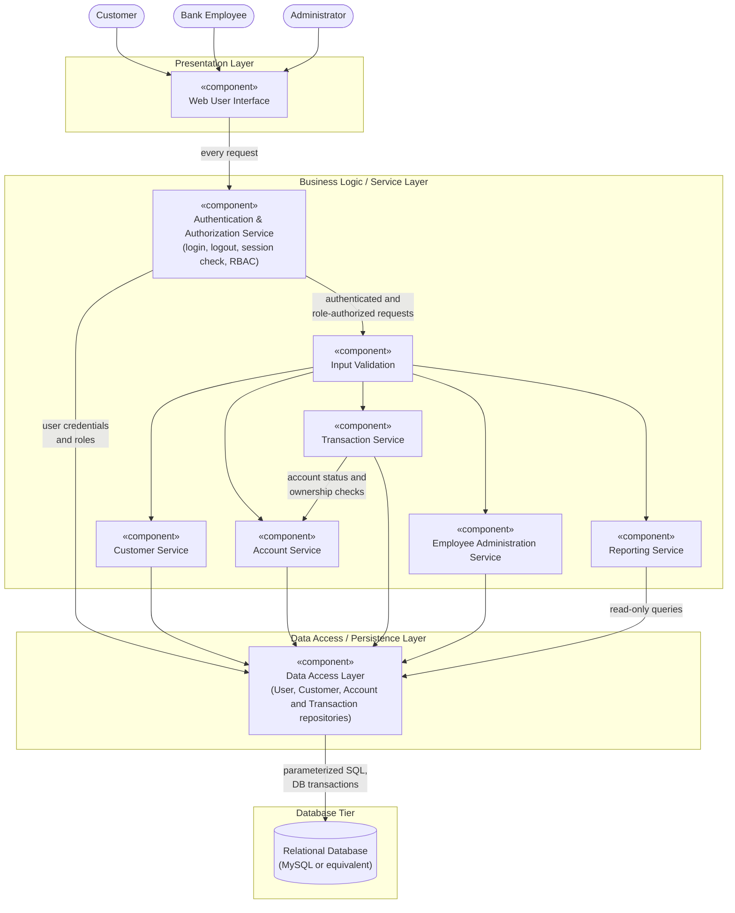

# Component Diagram

This diagram shows the planned logical components of the Bank Management System
and their dependencies. It follows the Layered / Three-Tier Architecture described
in [Software Architecture and Design Specification](../architecture_design.md).

> The components are a **planned design** for the academic prototype. They do not
> yet exist as implemented code.

## Legend

| Notation | Meaning |
|---|---|
| Rectangle marked «component» | A logical software component |
| Cylinder | Persistent data store |
| Arrow | "Uses" dependency: the source calls the target |
| Box around components | Architectural layer |

## Dependency Rules

1. The **Web User Interface** communicates only with the Business Logic / Service
   Layer. It never accesses the database directly.
2. Every request passes through the **Authentication & Authorization Service**
   first. Only login is allowed without a session; every other request must have
   a valid session and a role permitted for that operation (NFR-02, NFR-03,
   NFR-05).
3. Authorized requests then pass through **Input Validation**, so invalid data
   is rejected before any business logic runs (NFR-04, NFR-18).
4. Business services access data only through the **Data Access Layer**
   (NFR-14).
5. Only the **Data Access Layer** communicates with the **Relational Database**.
6. The **Transaction Service** asks the **Account Service** to check account
   ownership and status. It does not apply account rules itself.
7. The **Reporting Service** performs read-only queries and does not modify data.

## Component Summary

| Component | Main Responsibility | Key Requirements |
|---|---|---|
| Web User Interface | Role-specific pages, forms and navigation for all three actors | NFR-11, NFR-12, NFR-13 |
| Authentication & Authorization Service | Login, logout, password verification, session validation, role-based access | FR-01, FR-02, FR-03, FR-22, NFR-01, NFR-02, NFR-03, NFR-05 |
| Input Validation | Checks required fields, types, formats, lengths and ranges before business logic | NFR-04, NFR-18 |
| Customer Service | Register, view and update customer records | FR-04, FR-05, FR-06 |
| Account Service | Create accounts, generate account numbers, view accounts, manage account status | FR-07, FR-08, FR-09, FR-10, FR-11 |
| Transaction Service | Deposits, withdrawals, fund transfers, transaction records and history | FR-12 – FR-21, NFR-07 – NFR-10, NFR-17 |
| Employee Administration Service | Create, manage and deactivate employee accounts | FR-23, FR-24 |
| Reporting Service | Read-only summary reports for administrators | FR-25 |
| Data Access Layer | Repositories, parameterized queries, database transaction control | NFR-09, NFR-14, NFR-16, NFR-17, NFR-18 |
| Relational Database | Persistent storage with keys, constraints and ACID transactions | NFR-08, NFR-09, NFR-16, NFR-18 |

Full descriptions are in Section 4 of the
[Software Architecture and Design Specification](../architecture_design.md#4-component-architecture).
