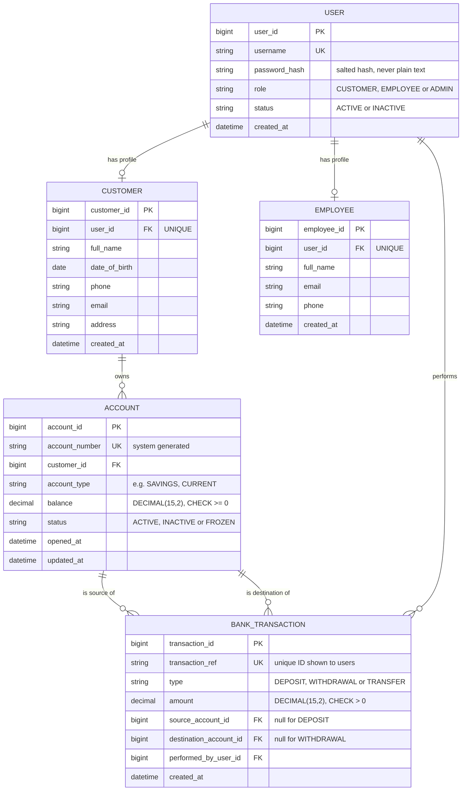
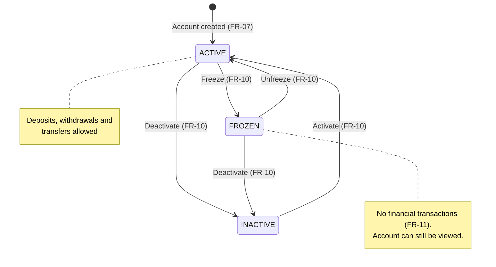

# Logical Data Model and Account Status States

These diagrams support the Data Design section of the
[Software Architecture and Design Specification](../architecture_design.md#7-data-design).
They are a **preliminary logical design**. The final database schema will be
produced in the system design phase.

## 1. Entity-Relationship Diagram

### Notes

| Design Point | Reason | Requirement |
|---|---|---|
| Each table has a primary key, and `username`, `account_number` and `transaction_ref` are unique | Unique identifiers enforced by the database | FR-08, FR-18, NFR-16 |
| `balance` and `amount` use `DECIMAL(15,2)`, not floating point | Exact money arithmetic without rounding errors | NFR-08, NFR-17 |
| `CHECK (balance >= 0)` and `CHECK (amount > 0)` | The database also rejects invalid values, as a second line of defence after input validation | FR-14, NFR-18 |
| Mandatory columns are `NOT NULL` | Incomplete records cannot be stored | NFR-18 |
| `password_hash` stores only the salted hash | Passwords are never stored in plain text | NFR-01 |
| The table is named `BANK_TRANSACTION` | `TRANSACTION` is a reserved word in SQL | — |
| `BANK_TRANSACTION` rows are insert-only (no update or delete operation is provided) | Transaction records cannot be changed after they are written | NFR-10 |
| Administrators are `USER` rows with role `ADMIN` and no extra profile table | Administrators need only login details (SRS A-07) | FR-03 |

## 2. Account Status State Diagram

| Status | Financial Transactions | Viewable | Changed By |
|---|---|---|---|
| ACTIVE | Allowed | Yes | Bank Employee |
| FROZEN | Rejected with `ACC_001` (FR-11) | Yes (SRS A-09) | Bank Employee |
| INACTIVE | Rejected with `ACC_001` (FR-11) | Yes (SRS A-09) | Bank Employee |
