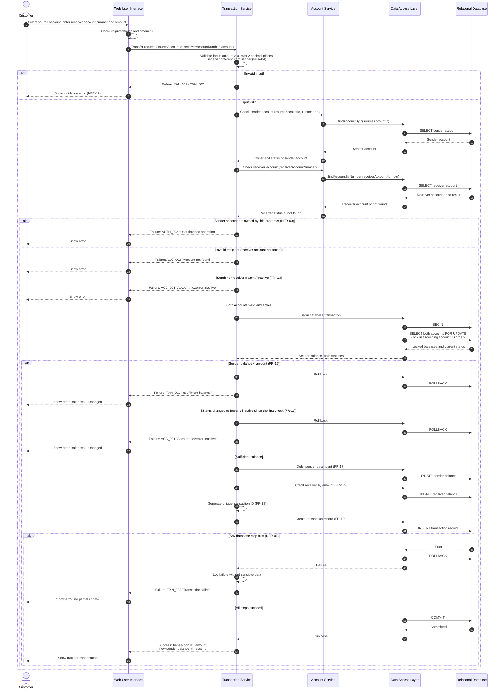

# Sequence Diagram — Fund Transfer

**Use case:** UC-04 (Transfer Funds)

**Requirements supported:** FR-11, FR-15, FR-16, FR-17, FR-18, FR-19, NFR-03,
NFR-04, NFR-07, NFR-08, NFR-09, NFR-17

**Planned API:** `POST /api/transfers` (see
[API Design](../architecture_design.md#9-api-design))

This diagram describes the planned fund transfer flow. It assumes that the
Authentication & Authorization Service has already confirmed a valid session and
the `CUSTOMER` role before the request reaches the Transaction Service (see
[login sequence](login_sequence.md) and
[Security Architecture](../architecture_design.md#6-security-architecture)).

## Notes

1. **Atomicity (NFR-09, NFR-17):** The debit, the credit and the transaction record
   are written inside one database transaction. They are either all committed or
   all rolled back, so a balance can never be left partially updated.
2. **Balance check under lock (FR-16, NFR-08):** The final balance and status
   checks happen after the account rows are locked. Two simultaneous transfers
   from the same account therefore cannot both spend the same money.
3. **Deadlock avoidance:** Both account rows are always locked in the same order
   (ascending account ID), whichever account is sending.
4. **Status checked twice (FR-11):** The early status check gives the customer a
   quick error message. The second check, under lock, handles the case where an
   employee freezes an account while a transfer is in progress.
5. **Transaction record (FR-18, FR-19):** A transaction record is only created for
   a completed transfer, and it is committed together with the balance changes.
6. **Performance (NFR-07):** The whole flow is expected to complete within
   5 seconds under the conditions defined in the SRS.
