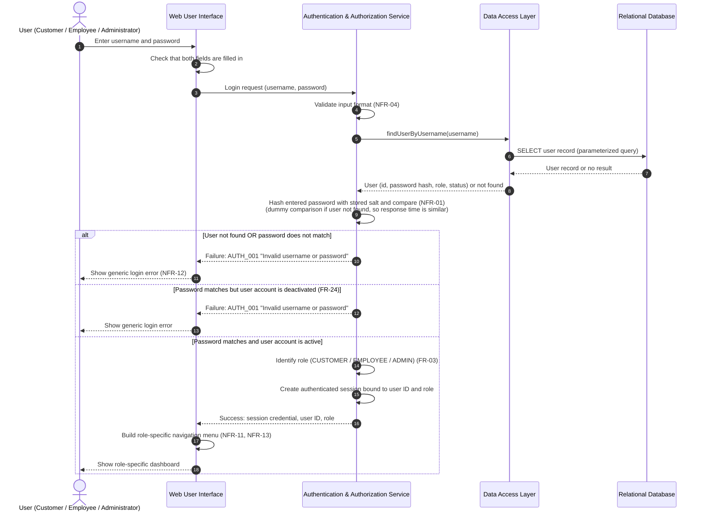

# Sequence Diagram — User Login

**Use cases:** UC-01 (Customer Login), UC-08 (Employee Login), UC-19 (Administrator Login)

**Requirements supported:** FR-01, FR-03, NFR-01, NFR-02, NFR-05, NFR-12

**Planned API:** `POST /api/auth/login` (see
[API Design](../architecture_design.md#9-api-design))

This diagram describes the planned login flow for all three actors. The session
mechanism (server-side session or token) has not yet been selected, so it is
shown generically as an "authenticated session".

## Notes

1. **Generic error message:** An unknown username, a wrong password and a
   deactivated account all return the same `AUTH_001` message. This prevents an
   attacker from learning which usernames exist.
2. **Password handling:** The password is only compared with the stored salted
   hash. It is never stored in plain text, written to logs or returned in a
   response (NFR-01).
3. **Session:** After successful login, every later request carries the session
   credential. The Authentication & Authorization Service validates it and
   checks the user's role before any protected operation runs (NFR-02, NFR-05).
4. **Logout (FR-02):** Logout invalidates the session on the server, so the old
   session credential can no longer be used for protected operations.
